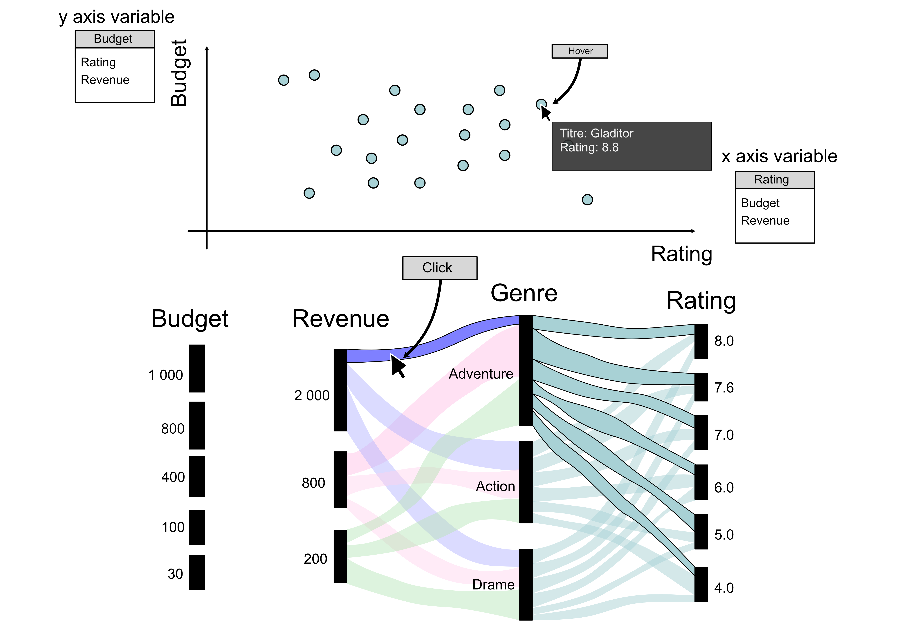

# Première proposition

* Association d'un *Alluvial Diagram* et d'un *scatter plot*

**Intéractions**

1. Possibilité de **cliquer** sur le **diagramme** **Alluvial** pour sélectionner que les données appartiennent au chemin. Cette action **filtre** ces données pour ne les **afficher** sur le **scatter plot**.
2. **Hover** au niveau du **scatter plot** pour pouvoir **selectionner** **un** **film** en particulier
3. Possibilité de choisir différentes variables au niveau du scatter plot

</img>

