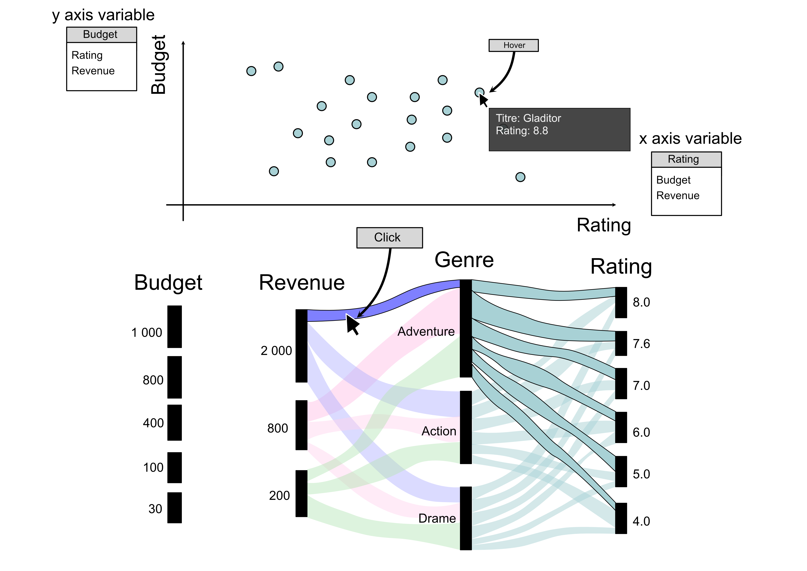
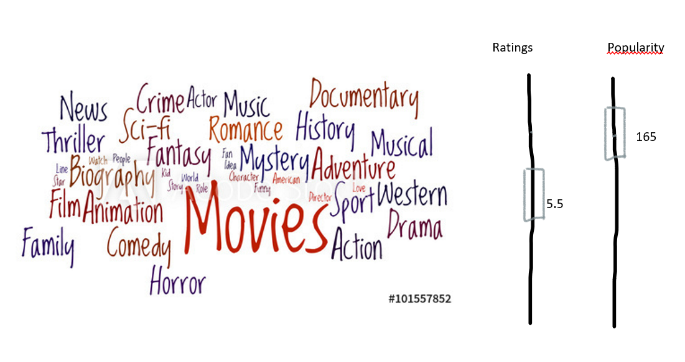
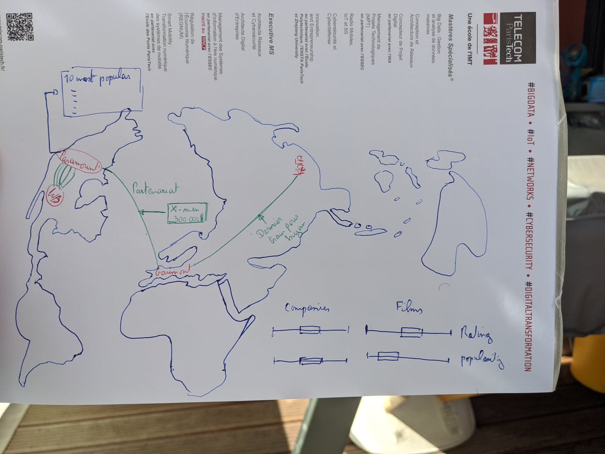

# Milestone 2 : Design Document

**Group Q : Axel CAMARA, François CULIERE, Matthieu DESSE, Vincent RICHARD and Hiroto YAMAKAWA**

Let's quickly remind our subject for this data visualisation project. We will try to understand what it makes a successful movie. We will answer to this question through the exploration of our dataset enhanced by external sources (Iothers kaggle..mdb, Numbers, ...)

For this Milestone 2, we propose to compare 4 different visualisation for a same dataset. It is obvious to say that it exists as much as different interlocutors than possible visualisation. But thanks to this exercise, we will try to hightlight that and find common ideas between graphs to build the best visualisation.

## 1. Let's compare our visualisations

### 1.1. Sketch 1

</img>

We have 2 parts on this visualisation. 

The first one proposed to show the impact of budget on the film. For that, we plot a scatter plot with a little interaction. When we hove the moose on the point, some film characteristics appears. With this simple visualisation, we can quickly the link between ratings and budget. However,  it is difficult to have a overview. Therefore, we have the second part. 

This one is little bit tricky. Indeed, we have a alluvial diagram which plot specific ways of data depending on the search filters. This diagram may more complex but it especially contains more information. Indeed, the interactivity allow to the user to apply its own filters and discovers the impact of the characteristics about the success of the film

### 1.2. Sketch 2 

Here, we have also 2 parts.

The first one is an overview of our dataset. It is interesting because we project our dataset through word bag in which the word size corresponds to its importance or impact related to our issue. Moreover, we added to cursor to observe the impact of 2 characteristics (here ratings and popularity).

The second visualisation is a world map which shows the geographical competition and dependence in the film industry. We added too some filters to custom the search. 

A drawback of these visualisations is its complexity. Indeed, it proposed a simple support but the data engineering may be complex. For instance,  it is not easy to represent categorical features on the word bags. Moreover, how we can represent data on a map, when a film is filmed in several locations around the world ? 

These representations are clear but we need to find the appropriate metrics to deliver the right message.

### 1.1. Sketch 3

</img>

This visualisation proposes to observe the evolution of characteristics over time. Thanks to the slider, we have two kind of interaction : "static" and dynamic. Indeed, static corresponds to year selection and dynamic a scroll the slide button. Contrary to the previous visualisations, this one introduces the time dimension. With other filters, we can custom the search. To enhance it we can add some search filters.

### 1.2. Sketch 4 

</img>

This representation proposes a funnel approach : begin from an overview to a focused view of a specific characteristic. The second objective will be to propose alternative views thanks to interactivity. Indeed, once main characteristics identified, we will develop tools to navigate among its.

We have imagined a simple web page as an infography that we can scroll. We have four parts :

- Overview : explore main characteristics
- Approach explanation with our custom metrics (financial, popularity, both, ...)
- Geographical view
- Custom view : e.g. actresses/actors bankable or attractive

2 important ideas :

- The funnel approach
- and the personalised experience through the interactive tools.

These two previous points imply that we adopt more an explanatory visualisation than exploration view.

## 2. Trade-offs and final proposition

After comparing these visualisations, we have decided to :

- adopt a funnel approach : begin from an overview to a focused view of a specific characteristic (word bags to the map or scatter plot)
- use the alluvial diagram as super filters. The user could select specific ranges,
- integrate the time dimension to see the impact of time about our issue,
- use interactivity (animation and search filters) to custom the user experience.