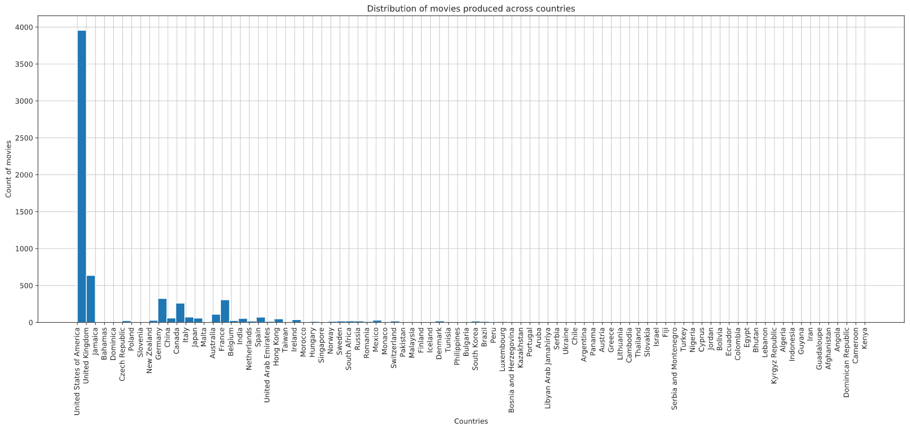
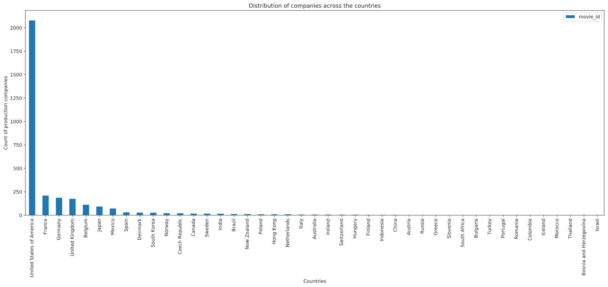
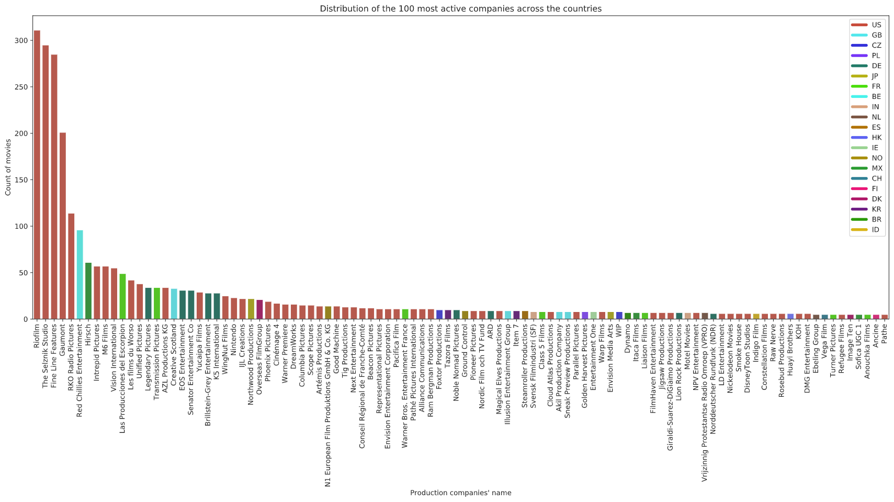
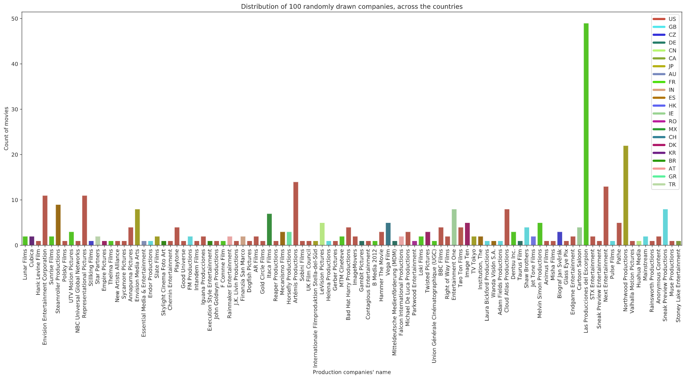
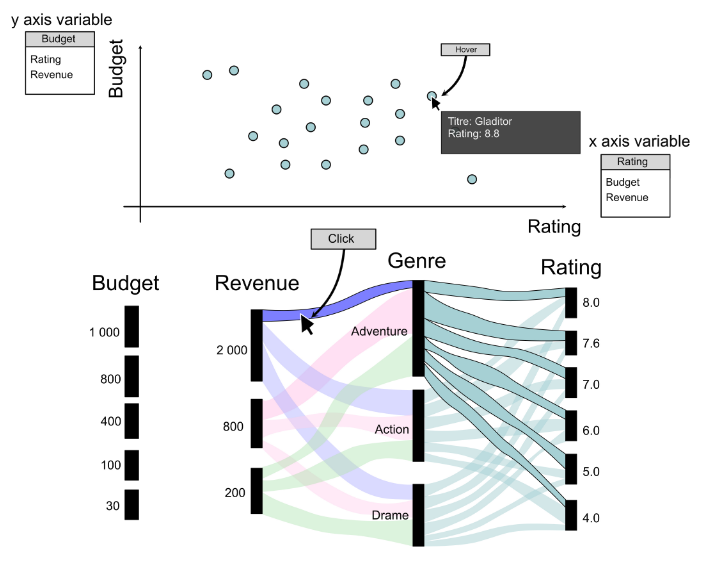
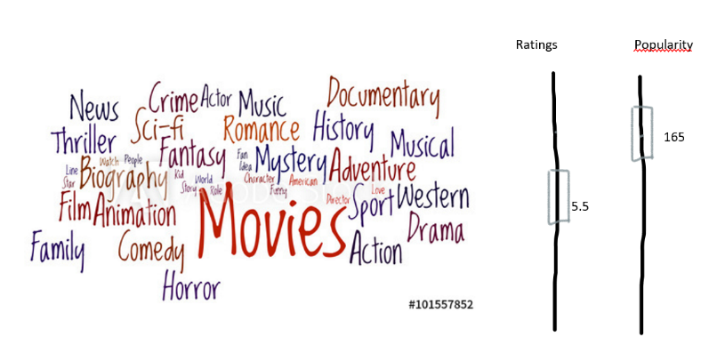
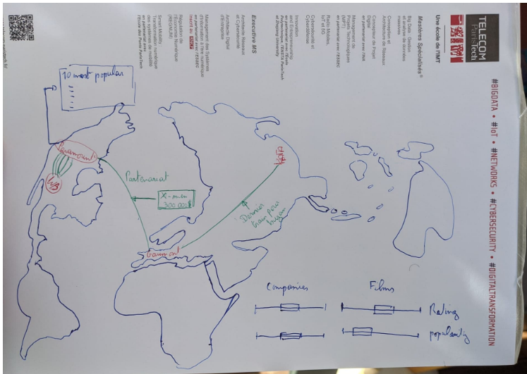
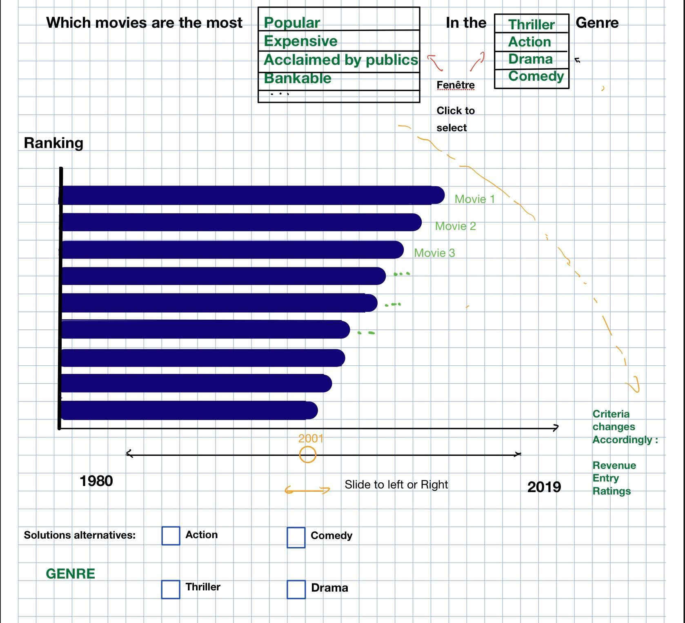
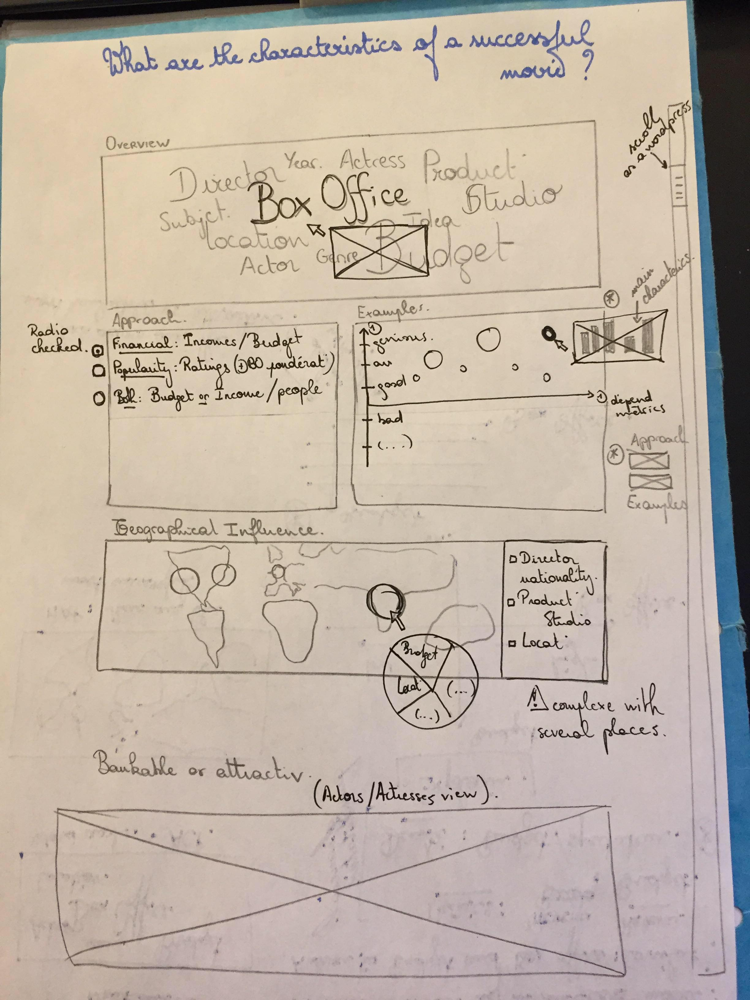
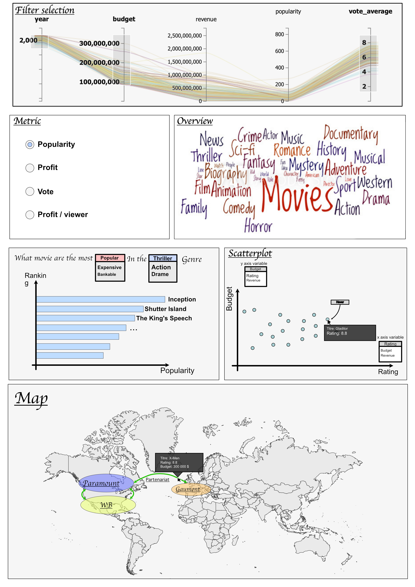

#  Milestone 2 : Design Document

**Group Q : Axel CAMARA, François CULIERE, Matthieu DESSE, Vincent RICHARD and Hiroto YAMAKAWA**

Through this visualization, we intend to explore and understand what are the main characteristics of a successful movie.   

Several metrics and information will be used , such as box-office admission, incomes, difference between incomes and production budget, ratings on specific websites (*imdb*, *allociné*). 

For the second milestone, we propose to compare 4 different visualizations for a same dataset. It is obvious to say that it exists as many as different interlocutors than possible visualizations. But thanks to this exercise, we will find common ideas between graphs to build the best visualization.

## 0. Data exploration

We chose a first dataset based on [The Movie Database (TMDb)](https://www.kaggle.com/tmdb/themoviedb.org) to begin our exploration. This dataset contains 5 000 entries of movies with several attributes:
- Movie's description (name, genre, overview, runtime, release date) ,
- The names of actors and people in the production team,
- The movie's popularity,
- The actors' popularity,
- The production companies and countries,
- People's ratings.

 By a quick look on the data, we could extract some statistics. This dataset contains:
 - 50 815 unique actors,
 - 10 808 unique production companies,
 - 88 unique countries.

</img>

 

</img>

 The two previous barplots show the distribution of movies and companies across the countries. Our dataset is mainly focused on the USA movies. This could be a limit for us and we may need to find additional data.

</img>

</img>

 This two bar plots show the number of movies produced by production companies. The color is linked to the country of production. We clearly see the ranking between the countries based on the number of movies produced.

## 1. Select a design requirement

To answer this question, we want our visualization to follow the Shneiderman's mantra :

>  "**Overview First, zoom and filter, then details-on-demand**" 

Since the dataset is rich and contains diverse type of information,  the **funnel approach** seems to be the best way to dive into it : begin from **an overview** and gradually move onto **a focused view** of a specific characteristic. Indeed, once main characteristics have been identified, we will have tools to navigate among them and to dive deeper in the details.

The second objective will be to propose alternative views thanks to interactivity. Perhaps, some users might have their own idea of what success is, and some flexibility will be required to adapt to their preference. Thanks to interactivity, the user experience is custom-made.

Below are some questions we asked ourselves to design the sketch:

- How to keep it simple ?
- How to organize visualization in order to follow the idea of funnel ? From the global to detailed views.

- How to allow the user to explore the dataset based on his/her own perception of success ?

- How to represent various type of information so that they can be better understood by the user ?

- How to keep a sense of space and time ?
- How to set interactivity with radio button, sliders ?

## 2. Sketching our ideas

Fueled with creative inspirations, we started to sketch potential designs and ended with the 3 following ideas :

### Design idea no.1 

</img>

From a user perspective, exploring the dataset means being able to **select and compare movies**, from a macro or detailed  point of view. 

1) the **scatterplot** gives the ability to **compare** movies  :

- features displayed on both axes  can be changed to compare different criteria (the number of feature pairs are not limitless, but still really high to keep the user engaged)

- the user can hover on the data point displayed to select a specific movie and get more information on it

- is suited for a detailed exploration analysis 

  

2) the **affluvial graph** on the other hand is useful to **select** movies :

- to filter movies can be filtered based on several criteria that 
- to find group of movies sharing common feature
- intended to give a higher view on the movie data.

To enhance the user experience, selecting information on one graph will also append instantly the information displayed on the other graph 

### Design idea no.2

</img>

</img>

the above design includes a **word cloud** and a **choropleth map**:

- The cloud appeals for its simplicity, emphasizing recurrent information, allowing us to draw a profile for successful movies. The user will be able to change the word cloud by manipulating two cursors : popularity and ratings (maybe budget/incomes ?). Users could see easily what concepts are hiding behind a good movies. 

- Since some features were related to geographical locations, displaying them on a Map seemed to be the most appropriate way to visualize those data. 

A drawback of these visualizations is their complexity. Indeed, it proposed a simple support but the data engineering may be complex. For instance, it won't be easy to represent categorical features on the word bags. Moreover, how can we represent data on a map, when a movie is filmed in several locations around the world ? Besides, when looking at the distribution of production countries on the graph above, most of these are made in the US. Therefore it seems tricky to use a  map to represent some information from the dataset. 

These representations are clear but we need to find the appropriate metrics to deliver the right message.

Another original view that can be explored:

### Design Idea no.3

</img>

The last representation is a **horizontal bar graph**:

- Its purpose is to include a **notion of evolution within time** : it will help the user compare movies based on a specific criteria, and see how the ranking evolves with time.  A specific genre,  criteria, and a year can be selected to see "the top 10" based on them.

  E.g.  which movies were the most expensive, or had the highest ROI, which genres were the most produced..

# Building our final Design

As previously stated, the 3 important ideas that had to be maintained was :

- The funnel approach, a.k.a  Shneiderman's mantra 
- a personalized experience through the interactive tools, giving the user the freedom to explore different aspects of the dataset, based on his/her needs and preferences
- a good user experience overall

After brainstorming, exchanging, debating the pros and cons, we ended up with the following unified design. The two points above led us to adopt an explanatory visualization rather than an explorative view.

**Here is what our final project will look like**:

The whole visualization will fit in a single web page, as an interactive infography. The user will be able to scroll to see the different sections  . We have four parts :

- Overview : explore main characteristics
- Explicative/Exploratory approach with our custom metrics (financial, popularity, both, ...)
- Geographical view
- Custom view : e.g. actresses/actors bankable or attractive

**Explanation :**

As a reader of this document, you may be surprised that we decided to gather the different designs previously sketched, (partly or as a whole)  rather than selecting only one of them. 

Indeed, we saw them as being complementary to each other,  each visualization being a unique component of our design and covering some weaknesses of an other graph:

- The scatter plot provides detailed information on movies but on its own, it might put off users for its perceived complexity. 

- The horizontal graph is easier to interpret, but only allows a comparison between movies on a single criteria.

- The information above might also be still too detailed for some users, who might be just looking for a trend. To them, getting an overview through the clouds of word would be the most efficient

- There is no movie without story, and no story without locations. To take into account that aspect, we concluded that the map would provide insights related to any geographical features, whether it's the studio address, the partnership, or where the scene were recorded,

**On improving the User experience**

Having radio buttons everywhere for each visualization seemed to bring more complexity. In order to keep a sense of unity, we decided to use the affluvial graph as the '**main tool**' to select and filter movies: the other visualization should be updated accordingly, based on criteria and ranges of values with the cursors.

To avoid the tedious task of  scrolling back and forth to change settings and see how it will affect the  desired results, this tool will slide along with the page to stay visible.

</img>

# Final design

